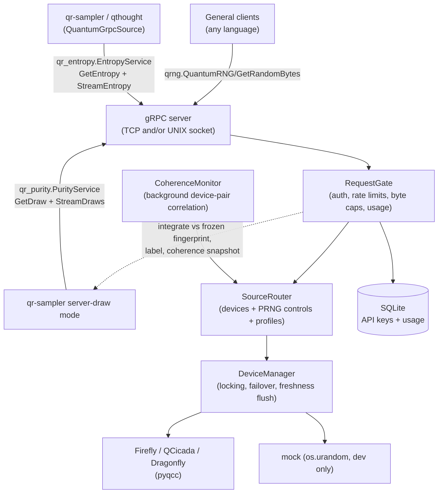

# Qbert0G

A gRPC service that streams **freshly measured quantum noise** from Crypta Labs QRNG devices (Firefly, QCicada, Dragonfly). Built for entropy research.

> **Not for cryptographic or security use.**
> Although Crypta Labs devices support cryptographic use cases, the output of this particular service isn't intended for such. If you need a cryptographic RNG service, look elsewhere.

## Features

- **Fresh and exclusive data per request** — no pooling, buffering, or pre-generation; every byte is measured upon request and served exclusively to the requester. When `freshness.flush_device_buffer` is on (the default), the serial receive buffer is flushed immediately before **every** measurement, so no byte measured before the request is ever served.
- **Three wire protocols on one server** — the public `qrng.QuantumRNG` service for general clients, the `qr_entropy.EntropyService` protocol consumed natively by [qr-sampler](https://github.com/Entropic-Science) (sequence-id echo, nanosecond generation timestamps, bidirectional streaming), and the `qr_purity.PurityService` QPI draw protocol (server-side integration of a raw block into one uniform value, with purity labels and the live coherence statistic).
- **The QPI layer** — per-source frozen statistical fingerprints, baseline-referenced integration statistics, a purity/integrity taxonomy on every draw, and a background cross-device coherence monitor. See [The QPI layer](#the-qpi-layer-purity-integrity-and-integrated-draws).
- **Low latency and efficient on the wire** — gRPC over HTTP/2; optional UNIX-domain-socket binding for co-located clients.
- **Per-request provenance** — responses carry `device_id` and a measurement timestamp so samples can be attributed and reproduced in datasets.
- **Selectable post-processing** — `raw` (zero post-processing), `sha256`, or `raw_samples`, globally or per device.
- **Device failover** — automatic fallback across configured devices.
- **API key management** — per-key rate limits, daily byte caps, and per-request byte caps, tracked in SQLite; managed via `qbert0g keys`.
- **Mock device type** — run the full server without hardware (`os.urandom`, loudly labelled NOT quantum) for development and CI.

## Architecture



All services share one request pipeline: auth, rate limiting, byte caps, source routing and usage accounting are identical regardless of which protocol a client speaks.

## Quick start

```bash
git clone https://github.com/Entropic-Science/Qbert0G
cd Qbert0G
pip install .

# Hardware devices additionally need pyqcc (wheel from Crypta Labs):
# pip install /path/to/pyqcc-x.y.z-py3-none-any.whl

cp config.yaml.example config.yaml
#   edit config.yaml: set auth.api_key, configure devices

qbert0g check-config          # validate before starting
qbert0g serve                 # run the server
```

Config resolution everywhere: `--config PATH` > `QBERT0G_CONFIG` env var > `./config.yaml`. A missing config file is an error — the daemon never starts on silent defaults.

To try it without hardware, configure a mock device:

```yaml
devices:
  - id: "mock-0"
    type: "mock"     # os.urandom — NOT quantum; development only
```

## The three protocols

### `qrng.QuantumRNG` — the public service

**Request (`RandomRequest`):** `num_bytes` (uint32). API key via gRPC metadata (default header `api-key`).

**Response (`RandomResponse`):** `data` (bytes), `timestamp` (uint64, epoch **microseconds**, stamped at measurement time), `device_id` (string).

```python
import grpc
from qbert0g.proto import qrng_pb2, qrng_pb2_grpc

channel = grpc.insecure_channel("localhost:50051")
stub = qrng_pb2_grpc.QuantumRNGStub(channel)
response = stub.GetRandomBytes(
    qrng_pb2.RandomRequest(num_bytes=100),
    metadata=[("api-key", "your-api-key-here")],
)
print(len(response.data), response.device_id, response.timestamp)
```

Or with grpcurl:

```bash
grpcurl -plaintext \
  -proto src/qbert0g/proto/qrng.proto \
  -H 'api-key: YOUR_API_KEY' \
  -d '{"num_bytes": 1024}' \
  localhost:50051 qrng.QuantumRNG/GetRandomBytes
```

### `qr_entropy.EntropyService` — the qr-sampler seam

**Request (`EntropyRequest`):** `bytes_needed` (int32), `sequence_id` (int64 — qr-sampler sends a 63-bit commitment nonce here on its pipelined path).

**Response (`EntropyResponse`):** `data`, `sequence_id` (echoed verbatim — this is what lets qr-sampler verify post-selection ordering, `echo_verified`), `generation_timestamp_ns` (epoch nanoseconds at measurement), `device_id`.

RPCs: `GetEntropy` (unary) and `StreamEntropy` (bidirectional stream — one response per in-stream request, each passing the full auth/limits gate). The bidi RPC is what unlocks qr-sampler's lowest-latency `bidi_streaming` mode.

A qr-sampler client needs **zero protocol configuration** — its defaults (`/qr_entropy.EntropyService/GetEntropy` + `StreamEntropy`) resolve against this server directly:

```python
from qr_sampler.contract import QRSamplerConfig
from qr_sampler.entropy.qgrpc.source import QuantumGrpcSource

source = QuantumGrpcSource(QRSamplerConfig(
    grpc_server_address="127.0.0.1:50051",
    grpc_api_key="your-api-key-here",
))
data = source.get_random_bytes(10_000)
```

See `examples/client.py` for a runnable demo of the byte protocols, and `tests/test_qr_sampler_seam.py` for the full cross-repo contract (echo verification, bidi streaming, legacy path).

### `qr_purity.PurityService` — the QPI draw seam

Instead of raw bytes, a *draw* returns one server-side **integrated** value: the server measures a fresh block (`integration.block_bytes`, default 2 MiB), reduces it to a baseline-referenced z-score against the source's frozen fingerprint, and maps it through the exact normal CDF to a uniform `u`.

**Request (`DrawRequest`):** `sequence_id` (int64, echoed verbatim — same commitment-nonce contract as EntropyService), `source_id` (string; empty = the API key's binding; must be in `integration.sources`), `block_bytes` (int64; 0 = the config default).

**Response (`DrawResponse`):** `u` (double, clamped to `(1e-10, 1-1e-10)` — never 0.0/1.0 on success), `z` (double), `sequence_id`, `generation_timestamp_ns`, `source_id`, `coherence_z` + `coherence_valid` + `coherence_r` (the live cross-device coherence snapshot; `coherence_valid=false` whenever the monitor is disabled, stale, or never computed — never a fake zero), `purity_label` (canonical string, see below), `integrated_bytes`, `integrator`.

RPCs: `GetDraw` (unary) and `StreamDraws` (bidirectional). Every draw passes the same `RequestGate` as the byte protocols — `block_bytes` is the accounted quantity, so draw-serving API keys need `max_bytes_per_request >= integration.block_bytes` (the service-wide default of 16384 is far below the 2 MiB default block).

Serving a draw requires configuration: `integration.sources` lists the drawable ids and **each must declare a `fingerprint:` path** (fitted offline with `scripts/fit_fingerprint.py`); a missing or invalid fingerprint refuses server startup — there are no silent ideal-value baselines. Profiles are not drawable in this iteration.

## Experiment arms: profiles and PRNG controls

Beyond physical devices, the server exposes two more source categories under
the **same id namespace** (API keys bind to any of them):

- **PRNG controls** (`controls:` in config) — seeded pseudorandom sources,
  loudly NOT quantum: `prng_uniform` (PCG64 raw-word stream) and
  `prng_markov` (order-1 byte Markov chain fitted to a specific card's
  statistical fingerprint via `scripts/fit_markov.py`). Seeds are required,
  so every served block is regenerable offline from
  `(id, seed, stream_offset_bytes)`.
- **Profiles** (`profiles:`) — named deterministic transforms over devices
  and/or controls: `identity`, `xnor` (agreement stream), `parity` (tapped
  XOR decimation). Typical arms: `qq-match` (xnor of two quantum cards),
  `qp-match` (quantum vs fitted control), `pp-match` (control vs control).

Serving rules: `device_id` in responses carries the **profile id**; byte
caps/rate limits count **served** bytes (raw input consumption is a
provenance fact); **profiles never fail over** — an unavailable input fails
the request rather than silently changing an arm's composition. Paired
quantum-quantum xnor reads lock both devices, flush once, read alternating
chunks with per-chunk timestamps, and log `max_pair_skew_ns` (WARNING above
`profiles_defaults.max_skew_ns`).

Every served request — gRPC or CLI — appends one record to the append-only
provenance JSONL (`provenance:` in config): per-input `kind`
(`"quantum"`/`"prng"`/`"mock"`), hardware chunk timestamps and health
snapshot, PRNG seeds and stream offsets. PRNG-involved blocks can be
regenerated byte-for-byte from the record alone.

```bash
qbert0g sources list                  # devices, controls, profiles + availability
qbert0g keys create --name study-arm --device qq-match   # keys bind to any source id
qbert0g profiles pull --id qq-match --bytes 100000000 --out qq.bin
    # offline generation through the EXACT serving code path (for ent/PractRand);
    # writes a provenance record marked protocol: "cli"
qbert0g sources watch --ids dragonfly-0,dragonfly-1
    # live bitstream sync viewer (see below)
```

### Bitstream sync viewer

`qbert0g sources watch --ids A[,B] [--bytes-per-row 4] [--rows N] [--interval S]`
prints the raw bitstreams of one or two devices side by side, one small
paired read per row **through the exact serving choreography** (lock
order, request-start freshness flush, per-chunk monotonic timestamps).
Each row shows the per-source capture timestamp, the capture→print
latency (the "physical generation vs displayed" measure), and — for a
pair — an agreement line between the streams (`|` where the bits agree,
which is exactly the XNOR gate's output; `.` where they differ) with a
running agreement % and the pair skew `dt` in µs. Output is ASCII-only
(survives cp1252 pipes). Works against `mock` devices, so it is
demoable anywhere; Ctrl-C exits cleanly.

## The QPI layer: purity, integrity, and integrated draws

The **quantum purity and integrity (QPI) layer** is this server's research core: it turns many weak measurements into one strong, auditable number, and labels every served value with exactly what it is. The research programme it serves — studying whether intent-correlated influence appears in quantum-random processes — used to live in qr-sampler under the name "consciousness signal amplification"; the mechanics now live here, under the more accurate name, and qr-sampler is a thin client. Full theory: *Listening to quantum noise: channels, extractors, integration, and the hybrid instrument* (Entropic Science working note v2, July 2026).

### Three channels an influence could use

A hypothesis about "influence on quantum randomness" is underspecified until it names its channel; every processing choice is silently a bet on one of them:

- **Channel A — bias.** The influence shifts the odds (ones become slightly more likely). Any extractor attenuates it; a hash erases it. The PurityService draw path is the channel-A instrument: it integrates an intact raw block into a baseline-referenced bit-fraction z (`bit_z`, the sufficient statistic for a uniform per-bit bias), so a per-event bias δ over a 2 MiB block yields z ≈ 8192·δ.
- **Channel B — selection.** The influence never changes the odds; it picks *which* particular outcomes occur within a normal-looking distribution. Aggregate statistics stay clean; the information lives in the specific sequence. The parity profiles and the offline statistics (`majority_vote`, `kmer_mode`) are channel-B instruments.
- **Channel C — coherence.** The influence induces correlation between two *physically separate* devices. The `CoherenceMonitor` runs the v2 block-correlation formulation: reduce each device's stream to per-block ones-fractions, Pearson-correlate the two series across a scan of relative lags (so clock skew and buffering don't matter), and Fisher-transform the peak into `z_c ~ N(0,1)` under the null. Matched PRNG pairs supply the empirical null (`qbert0g coherence null`).

### Purity by subtraction

Integration cannot sort quantum bits from classical bits — nothing can, per measurement. What it can do: classical *noise* is zero-mean and averages away as √n; classical *structure* (the device's bias, its correlations, its slow drift) is static or slow, so it is measured exhaustively beforehand and every statistic is referenced to that measured baseline — the **fingerprint** — rather than to a theoretical ideal. What survives integration-plus-referencing is fresh, systematic deviation from the characterized device: a quantity whose classical explanations have been individually measured and subtracted, and every subtraction is auditable (the fingerprint file's sha256 rides on every draw's provenance record). Fingerprints are **frozen at load** — a drifting baseline would slowly absorb exactly the sustained signal the integrators exist to see; re-characterization is an operator action between runs (`scripts/fit_fingerprint.py`).

Every draw also carries a canonical **purity label** — `origin/integrity/processing[/expanded][/amplified:<n>]/qf:<tier>[/QV]` (e.g. `quantum/intact/raw/amplified:2097152/qf:unrated/QV`). Labels record what a source is; they never gate what it may do. The `QV` (quantum_verified) bit is per-request: origin quantum AND integrity intact AND a clean device health snapshot at measurement AND the live block within `purity.verify_sigma` of the fingerprint.

### The hybrid instrument: a lever and a gate

Downstream (qr-sampler's `qthought_purity` preset), the two channels compose into a two-channel sampling architecture: the **lever** (channel A) — each token draw's `u` steers the probability-ordered token CDF, so a sustained nudge steers selection smoothly toward the conventional or the exotic; and the **gate** (channel C) — the coherence statistic modulates sampling temperature, bounded above and fail-safe by construction: absent, broken, stale, or null coherence yields exactly base temperature, so the failure mode of the exotic machinery is a boring, well-behaved language model. The gate lags the lever by one draw (coherence measured through token *t−1* gates token *t*) — structural causality, not simulation.

### QPI CLI

```bash
qbert0g draws pull --source dragonfly-0 --n 2000 --out u.txt
    # N draws through the EXACT PurityService serving path (no gRPC, no gate):
    # router read -> integrate -> label; one u per line; one provenance record
    # per draw (protocol: "cli" + the draw extras). Feed u.txt to a KS test
    # for the live-device uniformity check. --bytes overrides the block size.

qbert0g coherence null --minutes 30 --ids prng-a,prng-b --out null.json
    # Empirical null of z_c over a matched prng_uniform pair (no hardware).
    # JSON output: config echo, seeds + stream offsets (fully regenerable),
    # z_c summary with quantiles incl. 0.999, and a suggested gate threshold.
    # Point coherence.null_ref at the output. prng_markov is refused (its
    # regeneration is O(offset)). --evaluations N for an exact count.

qbert0g sources describe dragonfly-0
    # Canonical purity label, fingerprint path + sha256 (or "none"), default
    # integrator + block size, drawability, coherence-pair membership.
    # Config-only: never touches devices.
```

### QPI configuration

```yaml
integration:
  block_bytes: 2097152        # bytes integrated per draw (2 MiB: z ~ 8192*delta)
  default_integrator: bit_z   # serve path: bit_z | byte_z (aux/offline refused)
  secondaries: []             # cusum / rw_excursion — provenance-only aux stats
  sources: []                 # drawable ids; each REQUIRES fingerprint: on its entry
coherence:
  enabled: false
  pair: []                    # exactly 2 device ids when enabled
  block_bytes: 1024           # ones-fraction reduction block
  blocks_per_side: 32         # read per device per evaluation
  lag_scan_blocks: 4          # Pearson r scanned at lags in [-N, +N]
  min_valid_blocks: 24        # k_eff below this => evaluation invalid
  refresh_s: 1.0
  max_age_s: 5.0              # older snapshots serve coherence_valid=false
  null_ref: null              # `qbert0g coherence null` output (informational)
  null_pair: []               # default prng_uniform pair for the null CLI
purity:
  verify_sigma: 6.0           # |z| tolerance for the quantum_verified bit
devices:
  - id: "dragonfly-0"
    type: "dragonfly"
    path: "/dev/ttyQRNG0"
    fingerprint: "fingerprints/dragonfly-0_v1.json"   # scripts/fit_fingerprint.py
```

Integrators: `bit_z` (default; neff-corrected ones-fraction z) and `byte_z` (the historical qr-sampler byte-mean statistic, for continuity) serve draws; `cusum` and `rw_excursion` are aux secondaries (intermittent influence); `majority_vote` and `kmer_mode` are offline/CLI-only. The serve path refuses everything outside `SERVE_INTEGRATORS` at startup.

## API key management

The bootstrap admin key comes from `auth.api_key` in `config.yaml`: on first startup an enabled admin key (device `*`) is created for it. Changing the value later **adds** a second admin; revoke old keys explicitly.

All key management goes through the CLI (run on the server box; `--config` locates the database):

```bash
qbert0g keys list
qbert0g keys create --name "my-client" --device firefly-1
qbert0g keys create --name "high-volume" --device dragonfly-0 \
    --rate-limit 500 --daily-bytes 524288000 --max-bytes 65536
qbert0g keys create --name "ops-admin" --device "*" --admin
qbert0g keys update --id <key-id> --rate-limit 100
qbert0g keys disable --id <key-id>
qbert0g keys enable  --id <key-id>
qbert0g keys usage   --id <key-id> --days 30
qbert0g keys delete  --id <key-id>          # add --yes to skip the prompt
```

The raw key is printed once at creation and cannot be retrieved again (only its SHA-256 hash is stored).

**Per-key limits** (omit to use the service-wide default from `limits:`):

| Flag | Description |
|------|-------------|
| `--rate-limit RPM` | Max requests per minute |
| `--daily-bytes BYTES` | Max bytes served per day |
| `--max-bytes BYTES` | Max bytes per individual request |

## Configuration

See `config.yaml.example` for the full annotated schema. Highlights:

```yaml
server:
  listen: "127.0.0.1:50051"    # TCP bind; 0.0.0.0 exposes entropy off-box (warned)
  unix_socket: ""              # preferred transport for co-located clients
  request_timeout: 5.0
  failover_enabled: true
database:
  path: "./qbert0g.db"
auth:
  api_key: "..."               # bootstrap admin key
  header: "api-key"
limits:
  max_bytes_per_request: 16384
  max_bytes_per_day: 104857600
  rate_limit_per_minute: 200
post_processing:
  mode: raw                    # raw | sha256 | raw_samples
freshness:
  flush_device_buffer: true    # flush serial RX buffer before EVERY read
  emit_generation_timestamp: true
  allow_pooling: false         # declarative guard — true is refused
  allow_pregeneration: false
devices:
  - id: "dragonfly-0"
    type: "dragonfly"          # firefly | qcicada | dragonfly | mock
    path: "/dev/ttyQRNG0"
    streaming_mode: true
```

Validation is strict: **unknown keys are rejected at startup**, so a typo can never silently change what kind of randomness is served.

## Error handling

| gRPC Status | Reason |
|-------------|--------|
| `UNAUTHENTICATED` | Missing or invalid API key |
| `RESOURCE_EXHAUSTED` | Rate limit or daily byte limit exceeded |
| `INVALID_ARGUMENT` | Byte count is 0 or exceeds the per-request limit |
| `UNAVAILABLE` | No devices available or device error |
| `DEADLINE_EXCEEDED` | Request timed out waiting for a device |

## Development

```bash
pip install -e .[dev]
make test          # pytest (hardware not required — mock device)
make check         # ruff + pytest
make proto         # regenerate stubs for all three .proto files (qrng,
                   # entropy_service, purity_service); must be a no-op diff in CI
```

The cross-repo seam tests (`tests/test_qr_sampler_seam.py`) run automatically when qr-sampler is importable (`pip install -e ../qr-sampler`) and skip otherwise.

### Project structure

```
Qbert0G/
├── src/qbert0g/
│   ├── cli.py           # serve | keys | check-config | sources | profiles | draws | coherence
│   ├── config.py        # strict YAML schema (unknown keys rejected)
│   ├── database.py      # API keys + usage tracking (SQLite, hashed keys)
│   ├── devices.py       # DeviceManager: pyqcc drivers + mock, flush, failover
│   ├── controls.py      # seeded PRNG control sources (NOT quantum)
│   ├── profiles.py      # deterministic transforms (identity/xnor/parity)
│   ├── sources.py       # SourceRouter: one id namespace + provenance JSONL
│   ├── fingerprint.py   # frozen per-source statistical baselines (QPI)
│   ├── integrators.py   # integration statistics: raw block -> (z, u, aux)
│   ├── purity.py        # purity taxonomy + canonical labels
│   ├── coherence.py     # block correlation + background CoherenceMonitor
│   ├── gate.py          # shared request pipeline (auth, limits, measure)
│   ├── server.py        # all three gRPC servicers + QbertServer lifecycle
│   └── proto/           # qrng + entropy_service + purity_service protos & stubs
├── scripts/             # fit_markov.py, fit_fingerprint.py (offline fitting)
├── tests/               # config, devices, server, QPI, qr-sampler seam
├── examples/client.py   # byte protocols, runnable
└── config.yaml.example  # annotated canonical config
```

## Troubleshooting

- **`Config error: ... unknown key(s)`** — your config uses the pre-1.0 schema (`service:`, `admin_api_key`, integer `post_processing_mode`). Migrate to the schema in `config.yaml.example`; see `CHANGELOG.md`.
- **`pyqcc not available`** — install the wheel from Crypta Labs: `pip install /path/to/pyqcc-x.y.z-py3-none-any.whl`. Mock devices work without it.
- **Port already in use** — change `server.listen` in `config.yaml`.
- **Device permission denied** — add the service user to the `dialout` group.

## License

Licensed under the Apache License, Version 2.0. See [LICENSE](LICENSE).

```
Copyright 2026 Entropic Science, Bradley Stephenson (orphiceye)
```
